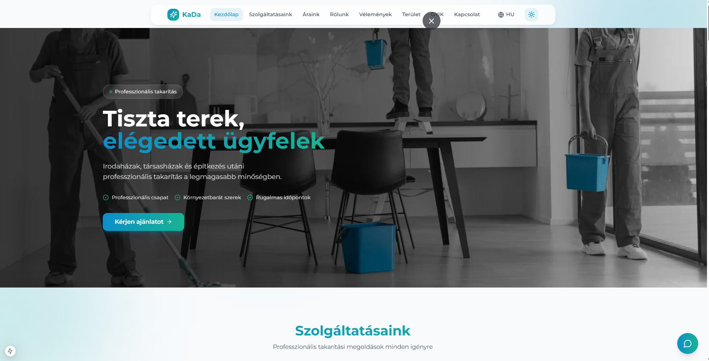

# KaDa Cleaning - Professional Cleaning Services Website

[](https://nextjs.org/)
[](https://react.dev/)
[](https://www.typescriptlang.org/)
[](https://tailwindcss.com/)
[](https://www.framer.com/motion/)

A modern, responsive website built with Next.js 15 for a professional cleaning services company. Features internationalization (HU/EN/DE), smooth animations, and a clean glassmorphism design.

## Preview



> **Live Demo:** [https://kada-cleaning-showcase.vercel.app](https://kada-cleaning-showcase.vercel.app)

## Features

- **Next.js 15** with App Router and React 19 RC
- **Internationalization** - Hungarian, English, and German language support with next-intl
- **Responsive Design** - Mobile-first approach with Tailwind CSS
- **Smooth Animations** - Framer Motion animations throughout
- **Dark Mode** - System-aware theme switching with next-themes
- **Modern UI** - Glassmorphism design, gradient accents
- **Form Handling** - React Hook Form with Zod validation
- **Carousel** - Service showcase with Embla Carousel

## Tech Stack

| Category      | Technology                |
| ------------- | ------------------------- |
| Framework     | Next.js 15                |
| Language      | TypeScript                |
| Styling       | Tailwind CSS 3.4          |
| Animations    | Framer Motion             |
| Forms         | React Hook Form + Zod     |
| i18n          | next-intl                 |
| UI Components | Radix UI primitives       |
| Icons         | Lucide React, React Icons |

## Getting Started

1. Clone the repository:

   ```bash
   git clone https://github.com/yourusername/kada-cleaning-showcase.git
   cd kada-cleaning-showcase
   ```

2. Install dependencies:

   ```bash
   npm install --legacy-peer-deps
   ```

   > **Note:** The `--legacy-peer-deps` flag is required due to React 19 RC peer dependency conflicts.

3. Run the development server:

   ```bash
   npm run dev
   ```

4. Open [http://localhost:3000](http://localhost:3000)

## Project Structure

```
├── app/
│   └── [locale]/          # Internationalized routes
│       ├── layout.tsx     # Root layout with providers
│       └── page.tsx       # Home page
├── components/            # React components
│   ├── ui/               # Reusable UI components
│   ├── hero.tsx          # Hero section
│   ├── services.tsx      # Services section
│   ├── pricing.tsx       # Pricing plans
│   ├── testimonials.tsx  # Customer reviews
│   ├── faq.tsx           # FAQ accordion
│   └── contact.tsx       # Contact form
├── hooks/                # Custom React hooks
├── i18n/                 # Internationalization config
├── lib/                  # Utilities and hooks
├── messages/             # Translation files (hu, en, de)
└── public/               # Static assets
```

## Key Sections

1. **Hero** - Animated hero with image carousel
2. **Services** - Four main service offerings with details
3. **Pricing** - Three pricing tiers with feature lists
4. **About** - Company info and feature highlights
5. **Testimonials** - Customer reviews grid
6. **Service Area** - Geographic coverage
7. **FAQ** - Expandable FAQ accordion
8. **Contact** - Contact form with validation

## Customization

- **Translations:** Edit files in `/messages/` for each language
- **Colors:** Modify `tailwind.config.ts` for brand colors
- **Content:** Update data in translation files
- **Images:** Replace images in `/public/images/`

## Scripts

```bash
npm run dev      # Start development server (Turbopack)
npm run build    # Production build
npm run start    # Start production server
npm run lint     # Run ESLint
```

## License

This project is for portfolio demonstration purposes.

---

Built with Next.js and deployed on Vercel.
